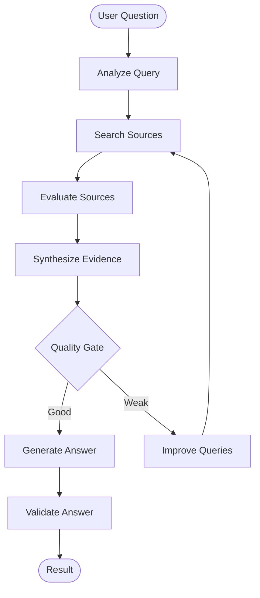

<div align="center">

# 🔍 EvoSearch

**An agentic AI research assistant that plans, searches, evaluates, synthesizes, and validates, instead of just answering.**


</div>

---

## Table of Contents

- [Overview](#overview)
- [Features](#features)
- [How It Works](#how-it-works)
- [Tech Stack](#tech-stack)
- [Project Structure](#project-structure)
- [Getting Started](#getting-started)
- [API Reference](#api-reference)
- [Frontend](#frontend)
- [Design Principles](#design-principles)
- [Roadmap](#roadmap)
- [Author](#author)

---

## Overview

Most LLM apps follow a simple pattern:

```text
Question → LLM → Answer
```

EvoSearch replaces that single step with a **multi-stage research workflow**. It plans the research, retrieves sources from the web, scores the evidence, synthesizes findings, checks whether the research is good enough, and validates the final answer against the sources it collected.

If the first pass turns up weak evidence, the agent rewrites its queries and runs **one additional research cycle** before answering.

---

## Features

| Area | Capabilities |
| --- | --- |
| **Planning** | Query analysis and automatic decomposition into focused search queries |
| **Retrieval** | Multiple web searches per task via SearXNG, with URL deduplication |
| **Evaluation** | Per-source scoring for relevance, authority, and freshness, combined into an overall score |
| **Synthesis** | Findings extracted from evidence and linked to their supporting sources |
| **Self-correction** | Quality gate that detects weak research and generates improved queries |
| **Generation** | Evidence-grounded answers, instructed to avoid unsupported claims and exaggeration |
| **Validation** | Final answer checked against retrieved sources before being returned |
| **Interface** | React UI showing the answer, sources, metrics, queries, and research stages |

---

## How It Works

The backend is a stateful [LangGraph](https://github.com/langchain-ai/langgraph) workflow.



### Pipeline stages

1. **Query Analysis**: The question is analyzed to identify key research dimensions, and the agent generates three focused search queries.
2. **Web Search**: Queries are sent to SearXNG. Multiple results are retrieved per query and duplicate URLs are removed.
3. **Source Evaluation**: Each source is scored on **relevance**, **authority**, and **freshness**. The scores are combined into an overall source score.
4. **Evidence Synthesis**: Evaluated sources are passed to a synthesis stage that extracts meaningful findings and ties them to supporting sources.
5. **Quality Gate**: The research is checked for relevance, useful evidence, coverage of important areas, and answerability.
6. **Query Improvement**: If research is weak, missing areas are targeted with new queries. A **maximum of one retry** is enforced to prevent endless search loops.
7. **Answer Generation**: The final answer is written from the synthesized evidence.
8. **Answer Validation**: The answer is checked against the retrieved sources before it is returned.

### Agent state

The graph carries the following state between nodes:

- User query
- Research plan
- Search queries
- Search results
- Evaluated sources
- Evidence summary
- Retry count
- Query history
- Generated answer
- Validation result

---

## Tech Stack

| Layer | Technologies |
| --- | --- |
| **Backend** | Python, FastAPI, LangGraph, LangChain |
| **LLM** | Ollama (local models) |
| **Search** | SearXNG (self-hosted metasearch) |
| **Frontend** | React, Vite, Axios, CSS |
| **Infrastructure** | Docker, Docker Compose |

---

## Project Structure

```text
EvoSearch/
├── backend/
│   ├── app/
│   │   ├── agents/
│   │   │   ├── graph.py        # LangGraph workflow definition
│   │   │   ├── nodes.py        # Node implementations
│   │   │   └── state.py        # Agent state schema
│   │   ├── tools/
│   │   │   └── search.py       # SearXNG search tool
│   │   └── main.py             # FastAPI entry point
│   ├── .gitignore
│   └── requirements.txt
│
├── frontend/
│   ├── src/
│   │   ├── App.jsx
│   │   ├── App.css
│   │   ├── index.css
│   │   └── main.jsx
│   ├── public/
│   ├── package.json
│   └── vite.config.js
│
├── searxng/
│   ├── docker-compose.yml
│   └── searxng/
│       └── settings.yml
│
├── .gitignore
└── README.md
```

---

## Getting Started

### Prerequisites

- [Python 3.11+](https://www.python.org/downloads/)
- [Node.js](https://nodejs.org/)
- [Docker Desktop](https://www.docker.com/products/docker-desktop/)
- [Ollama](https://ollama.com/)

### 1. Clone the repository

```bash
git clone https://github.com/<your-username>/EvoSearch.git
cd EvoSearch
```

### 2. Start SearXNG

```bash
cd searxng
docker compose up -d
```

SearXNG will be available at <http://localhost:8080>.

### 3. Start Ollama

Make sure Ollama is running and a model is available:

```bash
ollama list
```

If you don't have a model yet, pull one (for example, `llama3`):

```bash
ollama pull llama3
```

### 4. Start the backend

```bash
cd backend
python -m venv venv
```

Activate the virtual environment:

```bash
# macOS / Linux
source venv/bin/activate

# Windows (PowerShell)
venv\Scripts\activate
```

Install dependencies and run the server:

```bash
pip install -r requirements.txt
uvicorn app.main:app --port 8000
```

| Service | URL |
| --- | --- |
| Backend | <http://localhost:8000> |
| Interactive API docs | <http://localhost:8000/docs> |

### 5. Start the frontend

In a new terminal:

```bash
cd frontend
npm install
npm run dev
```

Open the URL printed by Vite (typically <http://localhost:5173>).

---

## API Reference

### `GET /health`

Health check.

**Response**

```json
{
  "status": "ok"
}
```

### `POST /research`

Runs the full research workflow for a question.

**Request**

```json
{
  "query": "What are the latest AI engineering trends?"
}
```

**Response** includes:

| Field | Description |
| --- | --- |
| Generated answer | The final evidence-based answer |
| Evaluated sources | Sources with relevance, authority, freshness, and overall scores |
| Queries used | Search queries executed by the agent |
| Research plan | The plan produced during query analysis |
| Retry count | Number of additional research cycles performed |
| Query history | All queries across research cycles |
| Validation status | Result of the final answer validation |

---

## Frontend

The React interface lets you:

1. Enter a research question
2. Start the research process
3. Watch research stages progress while the agent runs
4. Read the generated answer
5. Browse the retrieved sources
6. Inspect per-source evaluation metrics
7. Review the queries the agent used
8. See the final validation status

### Example

**Input**

```text
What are the latest AI engineering trends?
```

**Output**

The interface displays the research answer, retrieved sources, source metrics, search queries, validation status, and the number of retries.

---

## Design Principles

- **Agentic workflow**: Specialized stages are connected through a stateful LangGraph graph instead of one monolithic LLM call.
- **Evidence-based generation**: Answers are built from evidence gathered and synthesized during research.
- **Self-improvement**: Weak research is detected and corrected with improved queries and a bounded retry.
- **Validation**: Answers are checked against available evidence before being returned.
- **Observability**: The UI exposes the queries, sources, scores, and validation status behind every answer.

---

## Roadmap

- [ ] Streaming agent execution
- [ ] Parallel search execution
- [ ] Persistent research history
- [ ] Search result caching
- [ ] More robust structured LLM outputs
- [ ] Multi-model support
- [ ] Advanced source ranking
- [ ] Research memory
- [ ] Authentication
- [ ] Background research jobs
- [ ] Production deployment

---

## Author

Built as an AI Engineering portfolio project.
